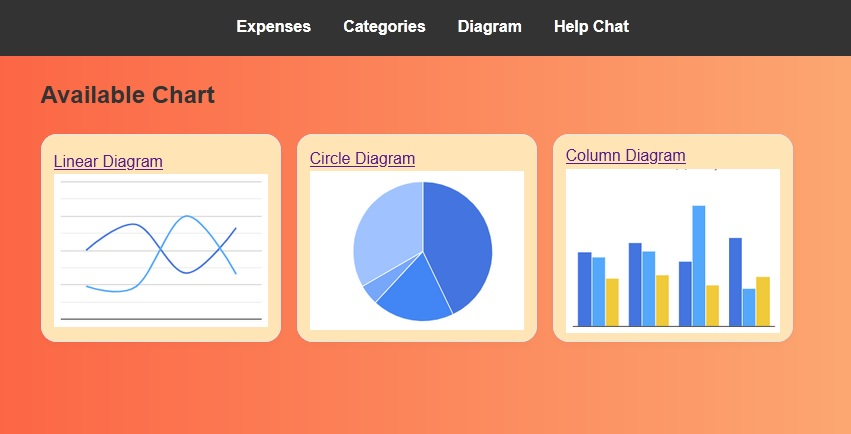
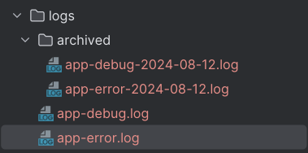

...
#   Expense-Tracker 
...
## Expense tracking project written in Java 17 

This project was created to implement an application for tracking and analyzing user expenses.

> ### The main functions for the user are:
* Manipulation with expense records (adding, changing, deleting)
* Availability of categories (creation, deletion, modification)
* Ability to communicate via chat with support to resolve issues
* Ability to view expense charts (time period, category)

> ### The main functions for the administrator are:
* Manipulation of user expense records (view, change)
* Availability of categories (viewing, changing)
* Viewing the list of users (Their costs)
* User activity tracking
* Opening tasks to help the user
* Real-time chat with users if necessary

> ### Some screenshots of usage provided

    
    
    
    
    
    <h3>For Manager/Administration</h3>
    
    
    
    
Saving logs

    

### Tech stack
* Java 17, Spring, Maven
* Docker 
* Hibernate, PostgresSQL, MongoDB
* Keycloak
* WebSockets 
* Apache Kafka
* Google Chart API
* AOP 
* Logback

#### Project is still under development
